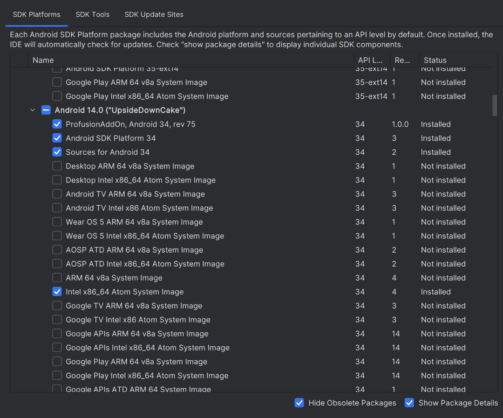
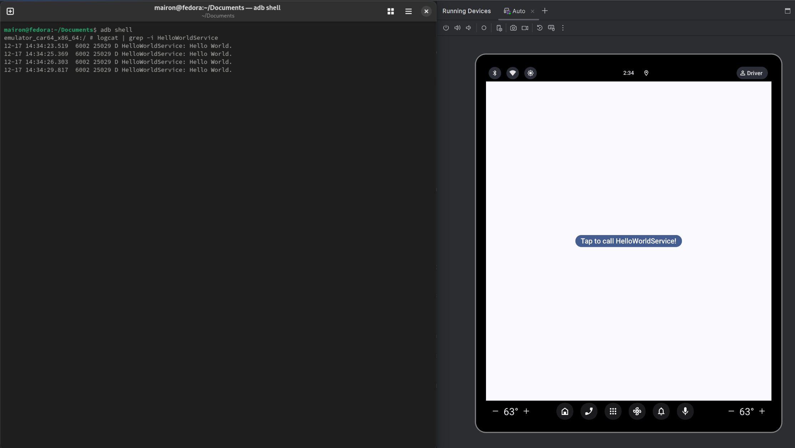

# How to build and use an SDK Add-on

Whether you are an OEM company or a developer customizing the Android Open Source Project, you might have come across the issue where you developed a feature and you would like for App developers to use it. That's when the SDK Add-on comes in handy.

The Android Software Development Kit (SDK) is a collection of libraries and tools that enables and makes it easier to develop Android applications. SDK Add-ons allow third-party actors to extend the Android SDK to add interfaces to their features without changing the Android SDK. According to the Android Compatibility Definition Document (CDD), OEMs are not allowed to change the Android public APIs - namely those in the protected namespaces: `java.*`, `javax.*`, `sun.*`, `android.*`, `com.android.*`. Therefore, by using add-ons, OEMs can add libraries in their namespaces, providing functionalities that can be exported without infringing the CDD. Having to build only the add-on is also a great advantage that might save a lot of development time.

In this post, we will build an SDK Add-on containing an example service - for which we will cover all the necessary config files. We will also learn how to connect an application to our example service using the add-on. Here, we are assuming you already have access to the Android source code and that you can build and deploy these changes. The code and configuration files were made with Android 10 (API level 30) in mind but they can be easily modifiable to work with other versions.

## Setting up the AOSP source tree

The source code of AOSP and all necessary tools can be downloaded following the [instruction on this link](https://source.android.com/setup/build/downloading).

This tutorial was written to be build with Android 14 (API 34). When pulling the code with `repo init`, specify the latest Android 14 code:

```bash
repo init -b android-14.0.0_r75 -u https://android.googlesource.com/platform/manifest
repo sync
```

### The content of this repository

This repository contains the code to build an emulator image containing the **hello-world-service**, the SDK add-on containing the **hello-world-service** service libraries that apps that use the **hello-world-service** will use on theirs build process, and a sample app that will use the SDK add-on. The summary of the code follows:

* `device/profusion/profusion_sdk_addon`: contains the configuration and manifest files for the SDK add-on. The `profusion_sdk_addon.mk` includes the **helloworld** product as part of this add-on;
* `pacakges/services/profusion/hello-world-service`: contains the service itself, that will be run in the emulator and serve the applications. The service will be part of the framework;
* `target`: contains files related to the emulator that will be created. Instead of creating a new device, we just modified the `sdk_car_x86_64.mk` and `car_generic_system.mk` to include our add-on.


We supply a shell script `add_to_aosp.sh` to automatically copy all code to the correct place in the AOSP source tree. Pass to the script the path to where the AOSP repo is:

```bash
./add_to_aosp.sh /pathTo/aosp
```

If you use VSCode, you can use [Run on Save](https://marketplace.visualstudio.com/items?itemName=emeraldwalk.RunOnSave) to automatically update the files with this script on save.


## Hello World System Service

To facilitate the understanding of how to build and extract your own SDK Add-on, we will create a simple "hello world" service so that later we can use an application to connect to it.

##### `HelloWorldService.java`

```java
package com.profusion.helloworld;

import android.app.Service;
import android.content.Intent;
import android.os.Binder;
import android.os.IBinder;
import android.util.Log;

public class HelloWorldService extends Service {
    private static final String TAG = "HelloWorldService";
    private IHelloWorldService.Stub mBinder;

    @Override
    public IBinder onBind(final Intent intent) {
        if (mBinder == null) {
            mBinder = new HelloWorld();
        }
        return mBinder;
    }

    private class HelloWorld extends IHelloWorldService.Stub {

        public HelloWorld() {
        }

        public void printHelloWorld() {
            Log.d(TAG, "Hello World.");
        }
    }
}

```

An [AIDL](https://source.android.com/devices/architecture/aidl/overview) interface is needed for a client app to connect to.

##### `IHelloWorldService.aidl`

```java
package com.profusion.helloworld;

interface IHelloWorldService {
    void printHelloWorld();
}
```

The service also needs a set of permissions that will be installed on the `/system/etc` directory. When the client app is installed, it will look for this file to determine if the HelloWorld library exists. The service library is installed in the `/system/framework` directory.

##### `helloworld-permissions.xml`

```xml
<?xml version="1.0" encoding="utf-8"?>
<permissions>
    <library name="helloworld" file="/system/framework/helloworld.jar"/>
</permissions>
```

If `helloworld-permissions.xml` does not exist, then the app will not be installed and `adb install` will return an error such as:
```
Failure [INSTALL_FAILED_MISSING_SHARED_LIBRARY: Package couldn't be installed...]
```

Also, `AndroidManifest.xml` needs to define the service interface.
##### `AndroidManifest.xml`

```xml
<?xml version="1.0" encoding="utf-8"?>
<manifest xmlns:android="http://schemas.android.com/apk/res/android"
      package="com.profusion.helloworld"
      android:versionCode="1"
      android:versionName="1.0"
      android:sharedUserId="android.uid.system">

    <application android:label="Hello World Service"
                 android:directBootAware="true">
        <service android:name=".HelloWorldService"
                 android:enabled="true"
                 android:exported="true" >
        </service>
    </application>
</manifest>

```

##### `hello-world-service/Android.bp`

The `android_app` entry is used to create the app. It tells Soong where the sources are, the [VINF](https://source.android.com/devices/architecture/vintf) manifest, and do other configurations to compile the service.

The `prebuilt_etc` entry tells the Soong to copy the `helloworld-permissions.xml` to the `/etc` directory.

The `java_sdk_library` entry specifies the sources to build an SDK library. This is used when creating the SDK. When you add the SDK to Android Studio, the application that you are developing will have access to this library.

The `javadoc` entry is used to create documentation for given sources. Text wrapped in `/* **/` is then included in the documentation. Check [javadoc](https://www.jetbrains.com/help/idea/viewing-reference-information.html) for more infos.

##### `hello-world-service/Android.mk`

Should contain commands that the blueprint cannot support. Since Android 11, the build system can create the `.jar` file with the Android blueprint. Checkout a previous commit in this repo to see how the Android make file was written to built the `.jar` file into Android 9.

## SDK Add-on configs
If you already have a service, then this is the interesting part:
You need a `.mk` file that defines the name and properties of your SDK Add-on, and several other files that define miscellaneous properties such as the API level being used, the revision version, and the libraries contained in the add-on. During the Android build, these files are bundled into a `.zip` containing the add-on to be distributed. In the next sections, I will go into further detail into each of the included files.

##### `profusion_sdk_addon.mk`

```make
# The name of this add-on (for the SDK)
PRODUCT_SDK_ADDON_NAME := profusion_sdk_addon

INTERNAL_SDK_HOST_OS_NAME := $(HOST_OS)

PRODUCT_PACKAGES := \
    helloworld

# Copy the manifest and properties files for the SDK add-on.
PRODUCT_SDK_ADDON_COPY_FILES := \
 $(LOCAL_PATH)/manifest.ini:manifest.ini \
 $(LOCAL_PATH)/source.properties:source.properties \
 $(LOCAL_PATH)/package.xml:package.xml

# Define the IMAGE PROPERTY (emulator related, but needed to build)
PRODUCT_SDK_ADDON_SYS_IMG_SOURCE_PROP := $(LOCAL_PATH)/source.properties

# Copy the jar files for the optional libraries that are exposed as APIs.
PRODUCT_SDK_ADDON_COPY_MODULES := \
    helloworld:libs/helloworld.jar

# Rules for public APIs
PRODUCT_SDK_ADDON_STUB_DEFS := $(LOCAL_PATH)/sdk_addon_stub_defs.txt
```

The `profusion_sdk_addon.mk` provides all the information needed to build the add-on, like the modules that will be included. In this case, we want to include our helloworld.jar, so we need to specify the module to be built in the `PRODUCT_PACKAGES` variable and copy it to the add-on using the `PRODUCT_SDK_ADDON_COPY_MODULES` variable. The `PRODUCT_SDK_ADDON_COPY_FILES` is used to copy the config files that will be used in Android Studio to build the application.

##### `manifest.ini`
```code
# SDK Add-on Manifest

name=ProfusionAddOn
name-id=profusionaddon
vendor=Profusion
vendor-id=profusion
description=Profusion SDK Add-On

api=34
revision=1
libraries=helloworld
helloworld=helloworld.jar
```
The `manifest.ini` file contains the properties of the add-on, including the Android API Level, the libraries included, and the revision number. If there is more than one library, they must be separated by a semicolon (;) and also be defined below in a new line containing the library name and its `.jar` file name.

##### `source.properties`
```code
Addon.NameId=profusionaddon
Addon.NameDisplay=ProfusionAddOn
Addon.VendorId=profusion
Addon.VendorDisplay=Profusion
Pkg.Desc=Profusion SDK Addon
Pkg.Revision=1
Pkg.UserSrc=false
Archive.Arch=ANY
Archive.Os=ANY

AndroidVersion.ApiLevel=34
SystemImage.TagDisplay=Profusion SDK Add-On
SystemImage.TagId=profusionaddon
SystemImage.Abi=${TARGET_CPU_ABI}
```
The `source.properties` defines add-on properties used for the built image, which can be distributed along with the SDK Add-on.

##### `package.xml`

```xml
<ns2:repository xmlns:ns2="http://schemas.android.com/repository/android/common/01" xmlns:ns3="http://schemas.android.com/repository/android/generic/01" xmlns:ns4="http://schemas.android.com/sdk/android/repo/addon2/01" xmlns:ns5="http://schemas.android.com/sdk/android/repo/repository2/01" xmlns:ns6="http://schemas.android.com/sdk/android/repo/sys-img2/01">
  <license id="license-CC939D3F" type="text"/>
  <localPackage path="add-ons;addon-profusionaddon-profusion-30" obsolete="false">
    <type-details xmlns:xsi="http://www.w3.org/2001/XMLSchema-instance" xsi:type="ns4:addonDetailsType">
      <api-level>34</api-level>
      <vendor>
        <id>profusion</id>
        <display>Profusion</display>
      </vendor>
      <tag>
        <id>profusionaddon</id>
        <display>ProfusionAddOn</display>
      </tag>
      <libraries>
        <library localJarPath="helloworld.jar" name="helloworld">
          <description>Hello World Library</description>
        </library>
      </libraries>
    </type-details>
    <revision>
      <major>1</major>
      <minor>0</minor>
      <micro>0</micro>
    </revision>
    <display-name>ProfusionAddOn, Android 34, rev 75</display-name>
    <uses-license ref="license-CC939D3F"/>
  </localPackage>
</ns2:repository>
```
The `package.xml` file makes it easier for Android Studio to import the add-on.

##### `sdk_addon_stub_defs.txt`

```code
+com.profusion.helloworld.*
```
The `sdk_addon_stub_defs.txt` file contains the rules for public APIs.

For these tests, I was using `lunch sdk_car_x86_64-trunk_staging-eng`, so I decided to add the reference to `profusion_sdk_addon.mk` in the `/device/generic/car/sdk_car_x86_64.mk`, but you may add it to whichever device you are using. Simply add:

```make
$(call inherit-product, $(SRC_TARGET_DIR)/product/profusion_sdk_addon/profusion_sdk_addon.mk)
```

### Building the SDK addon
The SDK Add-on is all set. Now we only have to build it. Notice, again, that I'm using `sdk_car_x86_64`:

```bash
. build/envsetup.sh
export TARGET=profusion_sdk_addon
lunch sdk_car_x86_64-trunk_staging-eng
make sdk_addon
```

When the compilation succeeds, you will see two `.zip` files at `out/host/linux-x86/sdk_addon`. `profusion_sdk_addon-linux.zip` will contain the addon itself, which will be used to develop and compile our app. `profusion_sdk_addon-linux-img.zip` will contain a set of files to run the emulator outside the AOSP file tree.

### Building Android

To build Android containing the library that we want to supply, do

```bash
# . build/envsetup.sh if you are doing it on a new shell
lunch sdk_car_x86_64-trunk_staging-eng
m
```

## Adding the SDK Add-on to Android Studio

Check the environment variable that points to Android's Sdk root.

```bash
echo $ANDROID_SDK_ROOT
```

If the variable is empty, you must define the path to your `Android/Sdk` directory. It is usually under your $HOME:

```
export ANDROID_SDK_ROOT=~/Android/Sdk # default location
```

Then, create a folder on your Android SDK for the add-ons. Afterward, extract the content of `profusion_sdk_addon-linux.zip` to a directory that matches the name defined at "localPackage" property of `packages.xml`.

```bash
mkdir -p "$ANDROID_SDK_ROOT"/add-ons # or ~/Android/Sdk/add-ons
unzip out/host/linux-x86/sdk_addon/profusion_sdk_addon-linux.zip -d "$ANDROID_SDK_ROOT"/add-ons
mv "$ANDROID_SDK_ROOT"/add-ons/profusion_sdk_addon-linux/ "$ANDROID_SDK_ROOT"/add-ons/addon-profusionaddon-profusion-34/
rm -rf "$ANDROID_SDK_ROOT"/add-ons/profusion_sdk_addon-linux # delete intermediate folder
```

Open Android Studio and go to Tools -> SDK Manager. Check the "Show Package Details" checkbox then you will be able to see the SDK Add-on for the API level configured.


## Using the SDK Add-on in an application

According to Android Studio, the correct way of using a custom SDK is to pass it as a String to `compileSdkVersion` property following this format: `"vendorName:addonName:api"`, so in our case it should be `"Profusion:ProfusionAddOn:34"`. But I wasn't able to use the addon this way, so I found a 'workaround' on StackOverflow that consists in: you must first use a `compileSdk` on the `build.gradle` that matches the API level of your addon (in our case, 34). Then you need to add the path to the add-ons folder on the `dependencies` block
```code
...
  compileOnly(fileTree(mapOf("dir" to "${android.sdkDirectory.path}/add-ons/addon-profusionaddon-profusion-34", "include" to listOf("**/*.jar"))))
...
```

Import the class from the SDK you'd like to use. In our case, it's `com.profusion.helloworld.IHelloWorldService`.
Sometimes Android Studio will not recognize the package, so I recommend you go to Tools -> SDK Manager and on the "SDK Location" click on `Edit` and don't change anything, but click `Next` until it finishes. This will force Android Studio to reparse the `package.xml` from the add-on.

Below is an example of an application using the HelloWorldService:
##### `MainActivity.kt`

```kotlin
package com.example.helloworldapp
...
import com.profusion.helloworld.IHelloWorldService

const val HELLO_WORLD_SERVICE_PACKAGE = "com.profusion.helloworld"
const val HELLO_WORLD_SERVICE = "$HELLO_WORLD_SERVICE_PACKAGE.HelloWorldService"
const val TAG = "HelloWorldApplication"

class MainActivity : ComponentActivity() {
    private var helloWorldService: IHelloWorldService? = null
    override fun onCreate(savedInstanceState: Bundle?) {
        super.onCreate(savedInstanceState)
        enableEdgeToEdge()
        setContent {
            HelloWorldAppTheme {
                Scaffold(modifier = Modifier.fillMaxSize()) { innerPadding ->
                    MainContent(
                        modifier = Modifier.padding(innerPadding),
                        onButtonClick = {
                            helloWorldService?.printHelloWorld()
                        }
                    )
                }
            }
        }
    }

    override fun onStart() {
        super.onStart()
        val intent = Intent()
        intent.component = ComponentName(HELLO_WORLD_SERVICE_PACKAGE, HELLO_WORLD_SERVICE)
        try {
            this.bindService(intent, serviceConnection, Context.BIND_AUTO_CREATE)
        } catch (e: Exception) {
            Log.e(TAG, "Unable to bind HelloWorldService", e)
        }
    }

    private val serviceConnection = object : ServiceConnection {
        override fun onServiceConnected(className: ComponentName, service: IBinder) {
            helloWorldService = IHelloWorldService.Stub.asInterface(service)
        }

        override fun onServiceDisconnected(className: ComponentName) {
            helloWorldService = null
        }
    }
}

@Composable
fun MainContent(modifier: Modifier = Modifier, onButtonClick: () -> Unit) {
    Column(
        modifier = modifier.fillMaxSize(),
        verticalArrangement = Arrangement.Center,
        horizontalAlignment = Alignment.CenterHorizontally,
    ) {
        Button(
            onClick = onButtonClick,
        ) {
            Text(
                stringResource(R.string.helloWorldButtonText),
                fontSize = 32.sp,
            )
        }
    }
}
```

Make sure to include the following in your `AndroidManifest.xml` under the application tag:

```xml
    <application
        >
        ...
        <uses-library android:name="helloworld"
            android:required="true" />
        ...
    </application>
```

And that's it!

## Running on the emulator
### Inside the AOSP tree

After build, you can run the emulator in the terminal where you set up the environment variables with

```
emulator
```

### Outside the AOSP tree

If you use a remote server to build your addon (It could be a good idea. Building the AOSP right now could be a really really hard job for some hardware) you will probably want to extract the emulator to your local machine. Actually, that's very easy and you already have all you need.

Go to your Android Studio and create an emulator using the *Device Manager* tool. Since we builded to a Automotive TARGET, select an hardware under the _Automotive_ category as well. For the _system image_, select (or download first if you don't have it yet) the API 34 image.

Before launching the emulator, extract the content of `profusion_sdk_addon-linux-img.zip` to the API 34 image folder:

```bash
unzip out/host/linux-x86/sdk_addon/profusion_sdk_addon-linux-img.zip -d $ANDROID_SDK_ROOT/system-images/android-34-ext9/android-automotive
```

---
Note: If you choose to build a different TARGET like `aosp_x86_64` or another, you will need to extract the content to a different path and the `profusion_sdk_addon-linux-img.zip` could not work as expected. In that case, you could use `make emu_img_zip` to generate a similar `sdk-repo-linux-system-images.zip` under `$PRODUCT_OUT` folder.

---

### Build and install the App

After including the SDK Addon that we created in the correct directory under your `$ANDROID_SDK_HOME`, you can build the app with Android Studio _Build > Make Project_, or with command line:

```bash
cd app/HelloWorldApp
./gradlew installDebug
```

or

```bash
cd app/HelloWorldApp
./gradlew build
adb install app/build/outputs/apk/debug/app-debug.apk
```

### Running the app

If you run the application and then check the `logcat` searching for "HelloWorldService," then you will be able to see the service printing "Hello World."

```bash
adb shell
# logcat | grep -i HelloWorldService
6002  6020 D HelloWorldService: Hello World.
```



### HAL example

There is an example on this repository of how to implement a HAL and expose a Manager through the SDK Add-on. If you want to see more about this, take a look at the [hal_example](https://github.com/profusion/android-sdk-addon-example/tree/hal_example) branch.
