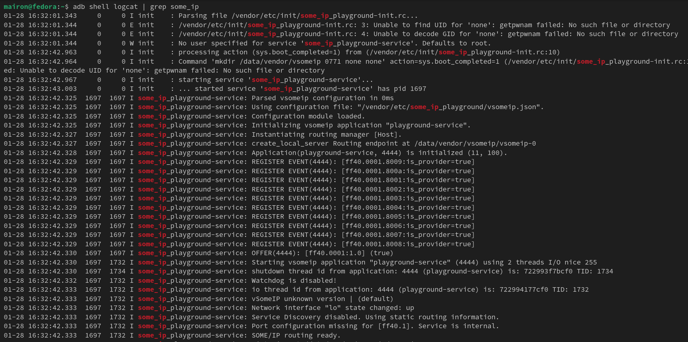

# HAL with SOME/IP and CommonAPI
The idea is that at some moment this repository also contains an implementation of a HAL that uses SOME/IP (through CommonAPI). The `hardware/implementations/some_ip_hal` directory already has some files related to the PlaygroundService, which will provide some mocked data through SOME/IP.
This PlaygroundService module is based on the implementation that can be found at [test-someip-service](https://github.com/COVESA/test-someip-service).

## About version

In this implementation, we use `capicxx-someip-runtime`, `capicxx-core-runtime`, and respective generators at version `3.2.0`. This version was chosen because we faced some problems when trying to compile the most recent versions, due to the vsomeip that comes with AOSP on API 34 don't have the rule to make `libsomeip3_dlt` and `libboost_log`, which are dependencies required by versions `<3.2.3`.

## CommonAPI Files
At this documentation, I will not go deeper into CommonAPI framework concepts. If you want to know more about it, please refer to the [CommonAPI documentation](https://covesa.github.io/capicxx-core-tools/).

#### `hardware/implementation/some_ip_hal/franca`
This directory contains the Franca files that will be used to generate the CommonAPI files. The `.fdepl` and `.fidl` files here are strictly the same as the ones used in [test-someip-service](https://github.com/COVESA/test-someip-service). These files define how CommonAPI should generate files to provide information about a vehicle, such as speed, gear, fuel level, etc.

#### `hardware/implementation/some_ip_hal/default/playground_service/mock`
This directory contains the mock values that will be used by the PlaygroundService to provide information about the vehicle.

#### `hardware/implementation/some_ip_hal/default/include`
This directory will contain the generated CommonAPI files. Commands to generate these files are shown below.

#### `hardware/implementation/some_ip_hal/default/playground_service/PlaygroundStubImpl.cpp` and `hardware/implementation/some_ip_hal/default/playground_service/PlaygroundStubImpl.hpp`
These files contain the implementation to `PlaygroundStubDefault`, which is basically the class that will provide the information about the vehicle to the PlaygroundService. Note that in `PlaygroundStubImpl.hpp` all the attributes come from the `Mock` class.

#### `hardware/implementation/some_ip_hal/default/playground_service/PlaygroundService.cpp`
```cpp
...
using namespace std;

int main() {
    std::cout << "SOMEIPPlayground: Successfully Registered Service!" << std::endl;
    std::shared_ptr<CommonAPI::Runtime> runtime = CommonAPI::Runtime::get();
    std::shared_ptr<PlaygroundStubImpl> playgroundService =
    std::make_shared<PlaygroundStubImpl>();
    runtime->registerService("local", "1", playgroundService);
    std::cout << "SOMEIPPlayground: Successfully Registered Service!" << std::endl;

    while (true) {
        playgroundService->updateTankVolume();
        playgroundService->monitorTankLevel();
        std::cout << "SOMEIPPlayground: Waiting for calls..." << std::endl;
        std::this_thread::sleep_for(std::chrono::milliseconds(500));
    }
    return 0;
 }
```

This file contains the main function of the PlaygroundService. The principal responsibility of this file is to register a service using the `PlaygroundStubImpl`. Also, this main function will loop indefinitely simulating the vehicle use, and updating the tank volume.

### Generating CommonAPI Files

Since you already cloned the necessary libs using `fetch_someip_libs.sh`, generate CommonAPI is very simple. To generate core files run:

```bash
./libs/someip-generators/commonapi_core_generator/commonapi-core-generator-linux-x86 -nv -sk \
--dest "hardware/implementations/some_ip_hal/default/include" \
hardware/implementations/some_ip_hal/franca/instances/org.genivi.vehicle.playground.fdepl
```

And to generate SOME/IP files run:

```bash
./libs/someip-generators/commonapi_someip_generator/commonapi-someip-generator-linux-x86 -nv \
--dest "hardware/implementations/some_ip_hal/default/include" \
hardware/implementations/some_ip_hal/franca/instances/org.genivi.vehicle.playground.fdepl
```

### Its necessary to start the service manualy?
No, the service will be started automatically through the `some_ip_playground-init.rc` file at Android boot:

```
service some_ip_playground-service /vendor/bin/some_ip_playground-service
    class main
    user none
    group none
    disabled
    setenv VSOMEIP_APPLICATION_NAME playground-service
    setenv VSOMEIP_CONFIGURATION /vendor/etc/some_ip_playground/vsomeip.json
    setenv VSOMEIP_BASE_PATH /data/vendor/vsomeip/

on property:sys.boot_completed=1
    mkdir /data/vendor/vsomeip 0771 none none
    start some_ip_playground-service
```

This file defines the necessary environment variables to start the service and also starts the service when the property `sys.boot_completed` is set to 1. Another important part is to create the directory `/data/vendor/vsomeip` where the vsomeip files will be located. This path will also be important when starting our HAL.

## Verify if Playground Service is running

To verify if the Playground Service is running, you can check the logcat output. With the emulator running, open a terminal and run this command:

```bash
adb shell logcat | grep some_ip
```

If the output is something like that, everything is working fine:



## Next steps

The next step is to implement the HAL that will communicate with the Playground Service. Probably, the first step is to create a class responsible for instantiating and handling the communication with `PlaygroundSomeIPProxy`, as it will be more sophisticated than handling everything in the HAL.

About the HAL, I would say that this implementation could be a good opportunity to understand how to communicate between application and the HAL using callbacks since it's a common pattern in Android development. Maybe register a callback to receive the car information updated by a loop in the Playground Service or something like that.

Another thing that is not exactly clear to me is if we should expose the AIDL interface from HAL in the sdk-addon to get a return of types and not only strings from the Manager or if we should create a new AIDL interface under the `packages` directory and map between the two interfaces. I think that this is an important point to discuss and understand the best approach.
